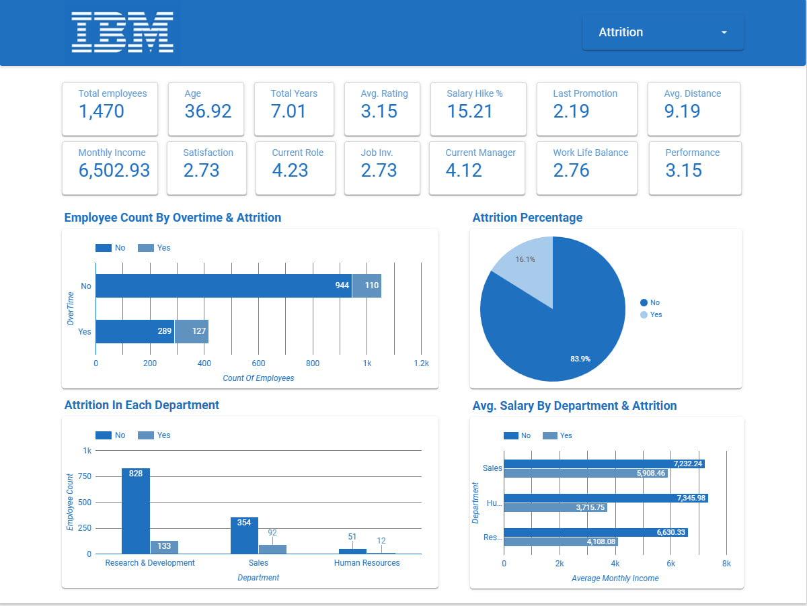
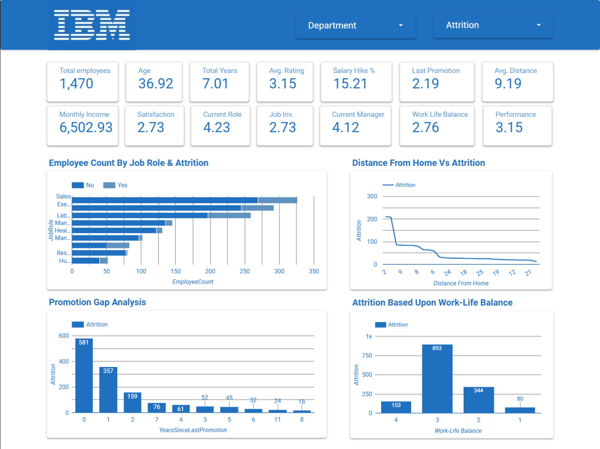
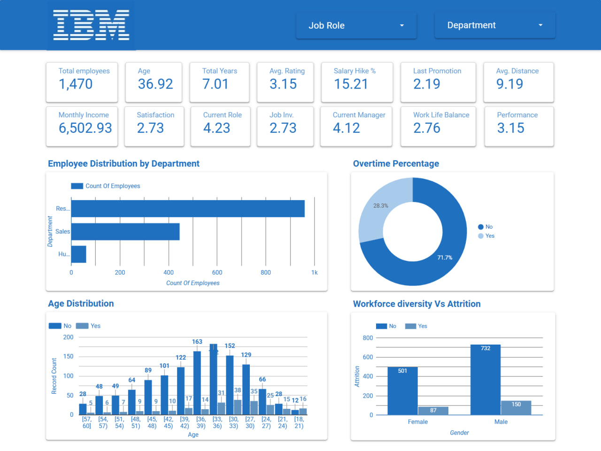
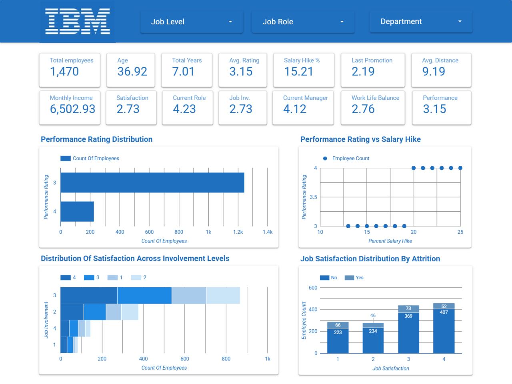
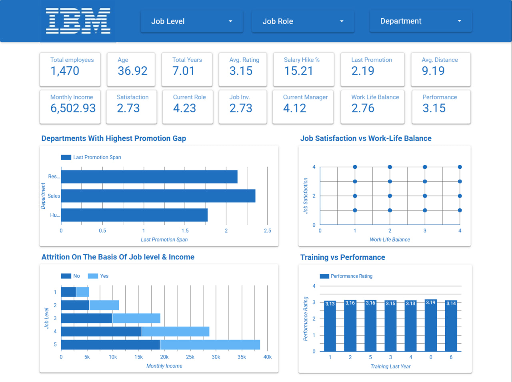
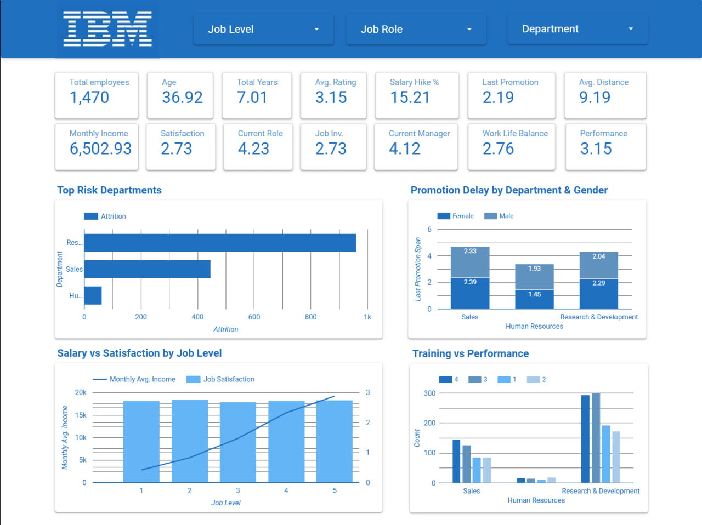

#  IBM HR Data Analytics - Employee Attrition Dashboard

---

## Project Overview
This project focuses on analyzing employee attrition using the IBM HR Analytics dataset. The aim is to identify key factors influencing employee turnover and provide actionable insights to improve employee retention.

An interactive dashboard was created using Looker Studio to visualize patterns across various dimensions such as age, salary, job satisfaction, and work-life balance.

---

## Objective
- Analyze employee attrition trends  
- Identify factors affecting employee turnover  
- Provide data-driven insights for HR decision-making  
- Improve employee retention strategies  

---

##  Dataset
- Source: [IBM HR Analytics Dataset (Kaggle)](https://www.kaggle.com/datasets/pavansubhasht/ibm-hr-analytics-attrition-dataset)
- Raw Dataset: Available in `Raw Dataset` folder  
- Cleaned Dataset: Available in `Cleaned DataSet` folder  

---

## Project Structure

```text
IBM HR
│── RawDataSet
│   └── IBM HR Raw Dataset.xlsx
│
│── CleanedDataSet
│   └── IBM HR Cleaned Dataset.xlsx
│
│── Dashboard
│   ├── Advanced HR Insights.jpg
│   ├── Attrition Overview.jpg
│   ├── Attrition Root Cause Analysis.jpg
│   ├── Executive Summary.jpg
│   ├── Performance & Employee Engagement.jpg
│   └── Workforce Overview.jpg
│
└── README.md
```

---

## Dashboard Overview

### 1. Attrition Overview


This dashboard provides a high-level summary of employee attrition. It includes KPIs such as total employees, attrition percentage, salary metrics, overtime impact, and attrition across departments.

---

### 2. Attrition Root Cause Analysis


This dashboard focuses on the major reasons behind employee turnover. It analyzes promotion gaps, work-life balance, distance from home, and attrition across job roles.

---

### 3. Workforce Overview


This dashboard highlights workforce demographics and organizational structure. It includes age distribution, department-wise employee count, gender diversity, and overtime percentage.

---

### 4. Performance & Employee Engagement


This dashboard explores employee performance and engagement. It covers performance ratings, job satisfaction, involvement levels, and salary hike trends based on ratings.

---

### 5. Advanced HR Insights


This dashboard presents advanced HR analysis such as job level vs income, training vs performance, promotion gaps by department, and work-life balance vs job satisfaction.

---

### 6. Executive Summary


This dashboard summarizes key findings for decision-makers. It includes top risk departments, promotion delay by department and gender, salary vs satisfaction by level, and training impact.

---


## Key Insights
- Employees working overtime have higher attrition rates  
- Lower salary bands and lower job levels show higher turnover  
- Employees with delayed promotions may have lower engagement  
- Work-life balance strongly impacts employee satisfaction  
- Training shows a positive relationship with performance ratings  
- Sales and Research & Development show notable workforce risks  

---

## Tools & Technologies Used
- Excel / Google Sheets (Data Cleaning)  
- Looker Studio (Dashboard Visualization)  
- GitHub (Project Hosting & Version Control)  

---

## Dataset Description
The dataset contains employee-related information including:

- **Demographics:** Age, Gender, Marital Status  
- **Job Details:** Department, Job Role, Job Level, Business Travel  
- **Compensation:** Monthly Income, Salary Hike %, Stock Option Level  
- **Experience:** Years at Company, Total Working Years, Years Since Last Promotion  
- **Satisfaction Metrics:** Job Satisfaction, Work-Life Balance, Environment Satisfaction  
- **Performance Metrics:** Performance Rating, Training Times Last Year  

---

## Conclusion
This project demonstrates how data analytics can be used to understand workforce behavior, reduce attrition, improve employee engagement, and support strategic HR decision-making.

The multi-page dashboard transforms raw HR data into meaningful insights for managers and business stakeholders.

---
